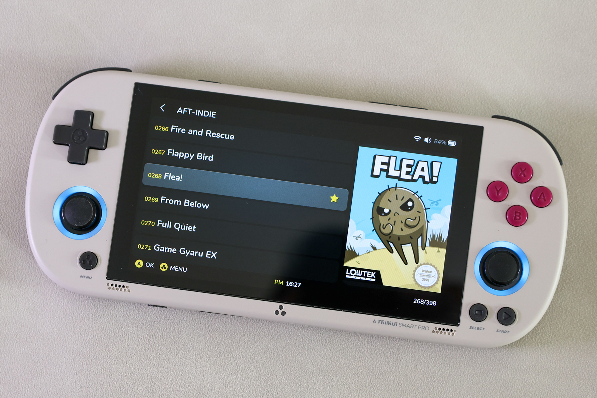

[查看中文说明 →](./README_ch.md)

# Theme Cozy 
for TrimUI Smart Pro（[CrossMix OS](https://github.com/cizia64/CrossMix-OS)）





## Instructions - Theme files only

1. Download the project file.
   
2. Copy the folder `CozyInstaller/ThemeFiles/Themes/Cozy` to your SD card's `Themes` folder.
3. **Settings** -> **Themes** -> **Cozy**


## Instructions - fully - App install

> [!IMPORTANT]  
> Your TrimUI Smart Pro's version need to be v1.3.0  
> You can find the latest version in [https://github.com/cizia64/CrossMix-OS](https://github.com/cizia64/CrossMix-OS)

It would take several copy-and-paste actions to apply a theme, so to make the process more convenient, I’ve created an app to handle it.   
You can use this app by following the instructions below.

1. Download the project file.
   
2. Place the `CozyInstaller` folder into your SD card's `Apps` folder.
3. Insert the SD card into your TSP device and reboot it.
4. Switch to the Apps tab, where you’ll see an app named **Cozy Installer**.  
      
5. Open the app to view the instructions, as shown below:
    

6. Press <kbd>A</kbd> to automatically install the Cozy theme onto your SD card. This includes:
   - theme deploy file `Cozy.sh`
   - theme files
   - replace all app's icon into cozy style (irreversible)
7. Navigate to **System Tools** -> **Theme** -> **Cozy** to switch to the Cozy theme.
8. Done! Enjoy your new theme.


## Instructions - fully - Manual install

> [!IMPORTANT]  
> Your TrimUI Smart Pro must be running version 1.3.0.  
> You can find the latest version at [https://github.com/cizia64/CrossMix-OS](https://github.com/cizia64/CrossMix-OS)

The process of manual installation is exactly the same as app installation.   
Therefore, I recommend using the app to install this theme.

Only consider manual installation if the app installation is not feasible for you.   
This situation may arise if you’ve made significant changes to CrossMix OS's file structure.


1. Download the project file.
   
2. Copy the folder `CozyInstaller/ThemeFiles/Themes/Cozy` to your SD card's `Themes` folder.
3. On your TrimUI Smart Pro, navigate to: **Settings** -> **Themes** -> **Cozy**.
4. The basic theme files will now be applied

### ADVANCED FILE REPLACEMENT


1. Match and replace all normal app icon files in `/mnt/SDCard/Apps/` with the corresponding files in `/CozyInstaller/ThemeFiles/Apps/`.
2. Match and replace all system app icon files in `/usr/trimui/apps/` with the corresponding files in `/CozyInstaller/ThemeFiles/usr/trimui/apps/`.
3. Add the BootLogo file `/CozyInstaller/ThemeFiles/BOOT_LOGO/COZY.bmp` to the folder `/mnt/SDCARD/Apps/BootLogo/Images/`.
4. Add the theme deployment file `/CozyInstaller/ThemeFiles/Cozy.sh` to the folder `/mnt/SDCARD/Apps/SystemTools/Menu/THEME##THEME PACK (value)/`.
5. Copy the folder `/CozyInstaller/ThemeFiles/Icons/Cozy/` into the folder `/mnt/SDCARD/Icons/`.
6. Copy the folder `/CozyInstaller/ThemeFiles/trimui/res/crossmix-os/style_Cozy/` into the folder `/mnt/SDCARD/trimui/res/crossmix-os/`.
7. Navigate to **System Tools** -> **Theme** -> **Cozy** to switch to the Cozy theme.
8. Done! Enjoy your new theme.


## Credit

**Font noto-sans:** from [fontsource](https://github.com/fontsource/fontsource)


## Other themes

I’ve previously created themes for three other open-source handheld devices. Feel free to check them out if you’re interested!

- **Cosy for Miyoo Mini+** `OnionOS` [onion-theme-cosy](https://github.com/KyleBing/onion-theme-cosy)
- **Cosy for Miyoo Flip** `StockOS` [theme-cosy-miyoo-flip-stock](https://github.com/KyleBing/theme-cosy-miyoo-flip-stock)
- **Cosy for Miyoo A30** `SpruceOS` [spruce-theme-cosy](https://github.com/KyleBing/spruce-theme-cosy)

Here are some retro console icon files available for you to use freely.
- [retro-game-console-icons](https://github.com/KyleBing/retro-game-console-icons)


## The progress of drawing missing game console icons.

[Icons Progress](./IconProgress.md)

## Struct

```shell
CozyInstaller/
└── ThemeFiles
    ├── Apps
    │   ├── BootLogo
    │   ├── EbookReader
    │   ├── EmuCleaner
    │   ├── FileManager
    │   ├── MusicPlayer
    │   ├── OTA-update
    │   ├── PortMaster
    │   ├── Reboot
    │   ├── RetroArch
    │   ├── Scraper
    │   ├── ScreenRecorder
    │   │   └── icon
    │   ├── SystemTools
    │   ├── Terminal
    │   ├── random
    │   └── user_guide
    ├── BOOT_LOGO
    ├── Icons
    │   └── Cozy
    │       └── Emus
    ├── Themes
    │   └── Cozy
    │       ├── skin
    │       └── sound
    ├── trimui
    │   └── res
    │       └── crossmix-os
    │           └── style_Cozy
    └── usr
        └── trimui
            └── apps
                ├── fn_editor
                ├── moonlight
                ├── player
                └── usb_storage

37 directories

```
