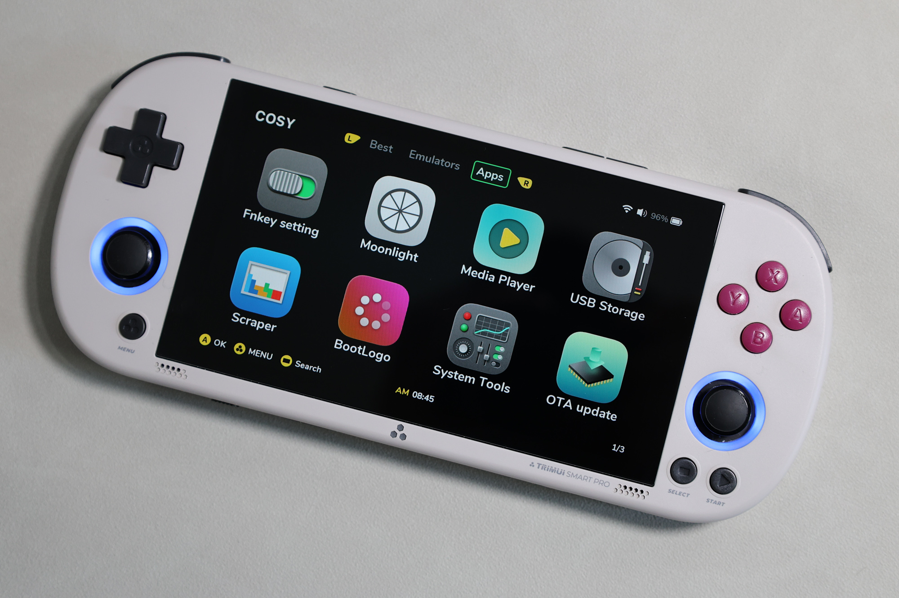
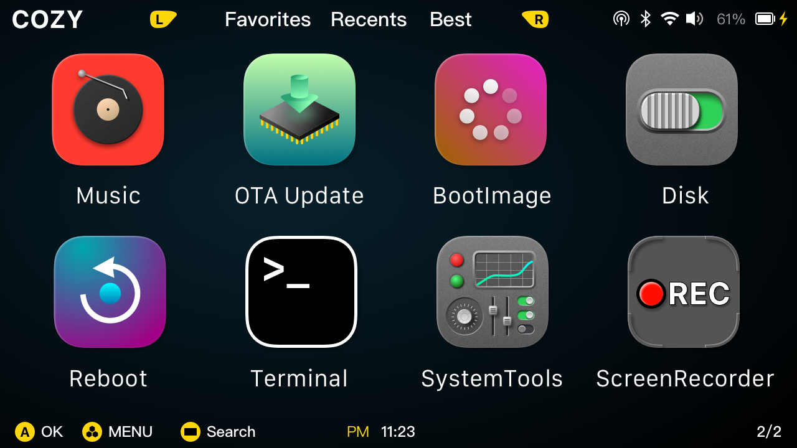
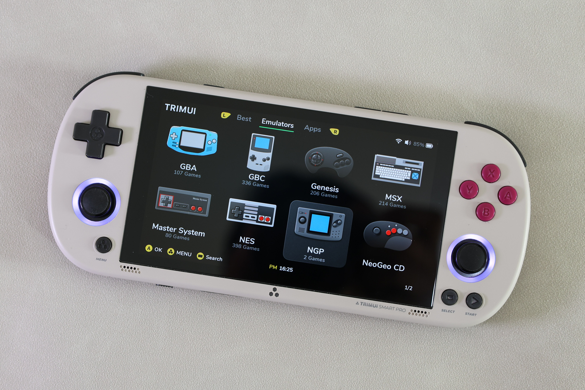
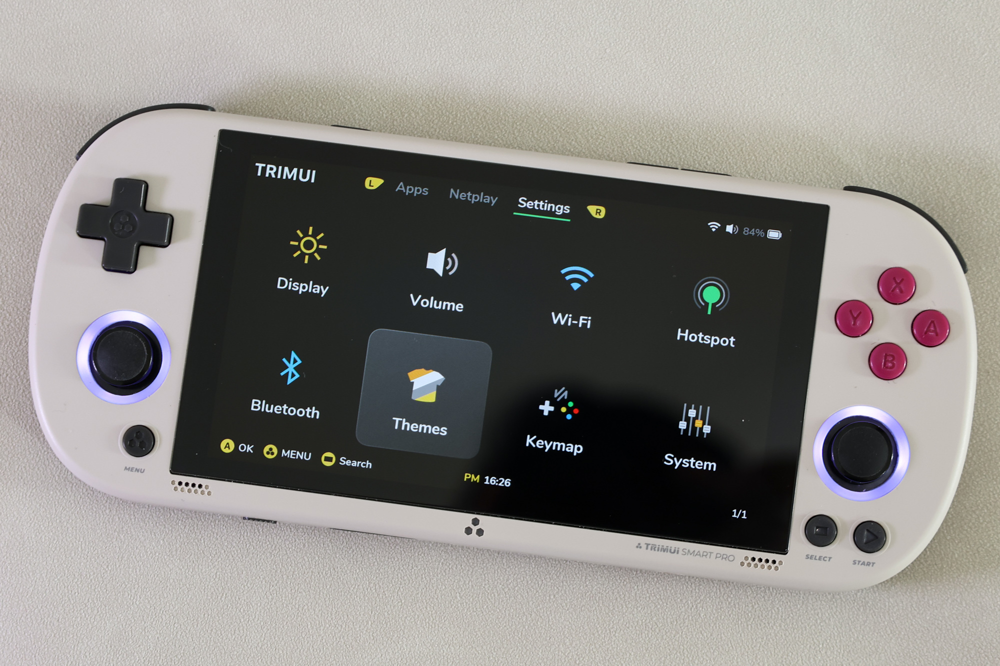
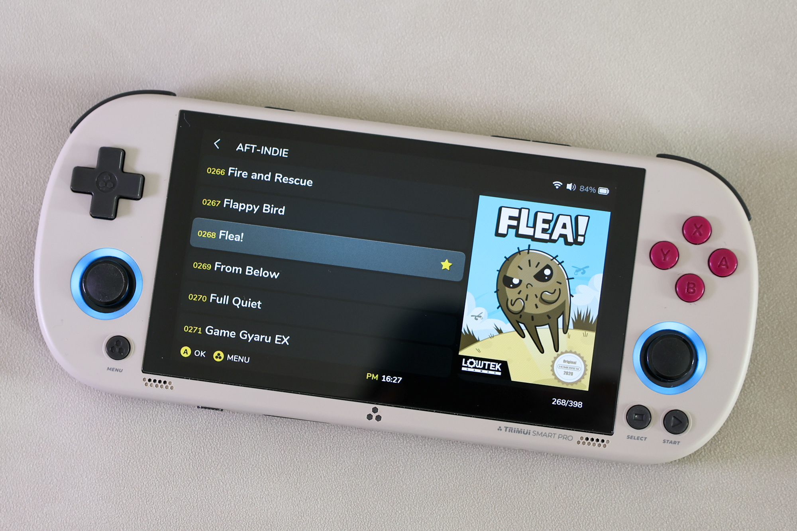
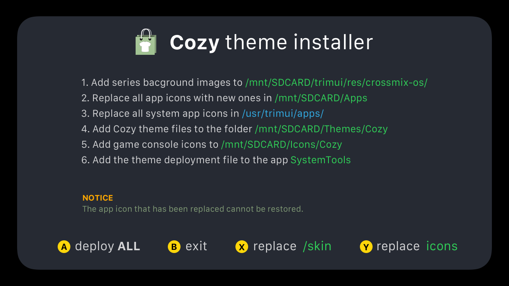

[to English](./README.md)

# Theme Cozy 
for TrimUI Smart Pro（[CrossMix OS](https://github.com/cizia64/CrossMix-OS)）










## 一、安装说明 - 只安装主题文件

1. 下载整个项目文件。
   
2. 复制文件夹 `CozyInstaller/ThemeFiles/Themes/Cozy` 到内存卡的 `Themes` 文件夹。
3. 在设备上切换主题  **Setting** -> **Themes** -> **Cozy**


## 二、安装说明 - 通过 App 安装

> [!IMPORTANT]   
> 你的设备需要安装 CrossMix OS，并且版本是 v1.3.0  
> 从这里更新最新系统 [https://github.com/cizia64/CrossMix-OS](https://github.com/cizia64/CrossMix-OS)

为了更方便的安装主题相关文件，我作了一个 app 来处理这些事。按照下文指示操作即可。

1. 下载整个项目文件。
   
2. 把下载好的 `CozyInstaller` 文件夹放到内存卡的 `Apps` 文件夹下。
3. 内存卡放回设备中，开机。
4. 切到 **Apps** 标签，你会看到多出一个 app 名为 **Cozy Installer**  
      
5. 打开它，就能看到里面的提示如下，就是提示一些要添加或替换的文件：
    

6. 根据提示按下按键 <kbd>A</kbd>，这个 app 就会自动将所有主题相关文件添加到系统中，包含如下：
   - 主题部署脚本文件 `Cozy.sh`
   - 主题文件
   - 替换所有 app 图标到 Cozy app 图标（此过程不可逆）
   - 替换所有系统 app 图标到 Cozy app 图标（此过程不可逆）
7. 打开 app **SystemTools** -> **Theme** -> **Cozy**，就会切换到 Cozy 主题。
8. 完成。


## 三、安装说明 - 手动安装

> [!IMPORTANT]  
> 你的设备需要安装 CrossMix OS，并且版本是 v1.3.0  
> 从这里更新最新系统 [https://github.com/cizia64/CrossMix-OS](https://github.com/cizia64/CrossMix-OS)

手动安装的过程，完全是上面 app 安装的所有过程。  
所以如果不是你非常大尺度的修改了整个系统的目录结构，还是建议使用 app 安装，省劲儿。

1. 下载整个项目文件。
   
2. 复制文件夹 `CozyInstaller/ThemeFiles/Themes/Cozy` 到内存卡的 `Themes` 文件夹。
3. 在设备上切换主题  **Setting** -> **Themes** -> **Cozy**
4. 基本的主题就已经切换成功了

### 高级主题文件操作

1. 一一替换所有在  `/mnt/SDCard/Apps/` 下的 app 图标，一一对应这个文件夹中的内容 `/CozyInstaller/ThemeFiles/Apps/`。
2. 一一替换所有在 `/usr/trimui/apps/` 下的系统 app 图标，一一对应这个文件夹中的内容  `/CozyInstaller/ThemeFiles/usr/trimui/apps/`。
3. 添加启动画面文件 `/CozyInstaller/ThemeFiles/BOOT_LOGO/COZY.bmp` 到 BootLogo app 的资源文件夹 `/mnt/SDCARD/Apps/BootLogo/Images/`。
4. 添加主题部署文件 `/CozyInstaller/ThemeFiles/Cozy.sh` 到文件夹 `/mnt/SDCARD/Apps/SystemTools/Menu/THEME##THEME PACK (value)/`。
5. 复制文件夹 `/CozyInstaller/ThemeFiles/Icons/Cozy/` 到文件夹 `/mnt/SDCARD/Icons/`。
6. 复制文件夹 `/CozyInstaller/ThemeFiles/trimui/res/crossmix-os/style_Cozy/` 到文件夹 `/mnt/SDCARD/trimui/res/crossmix-os/`。
7. 依次打开 **SystemTools** -> **Theme** -> **Cozy**，就会自动部署这个主题。
8. 完成。


## 字体

**Font noto-sans:** from [fontsource](https://github.com/fontsource/fontsource)


## 我的其它掌机主题

我之前还做了 Miyoo 三款设备的主题，都是同一个名，有兴趣的可以看一看。

- **Cosy for Miyoo Mini+** `OnionOS` [onion-theme-cosy](https://github.com/KyleBing/onion-theme-cosy)
- **Cosy for Miyoo Flip** `StockOS` [theme-cosy-miyoo-flip-stock](https://github.com/KyleBing/theme-cosy-miyoo-flip-stock)
- **Cosy for Miyoo A30** `SpruceOS` [spruce-theme-cosy](https://github.com/KyleBing/spruce-theme-cosy)


这里还有我绘制的一些复古游戏机图标，各种尺寸，随便用，主要不商用就可以：
- [retro-game-console-icons](https://github.com/KyleBing/retro-game-console-icons)


## 绘制缺失游戏机图标的进程

[Icons Progress](./IconProgress.md)

2025-03-23 绘制完成

## 项目文件结构

```shell
CozyInstaller/
└── ThemeFiles
    ├── Apps
    │   ├── BootLogo
    │   ├── EbookReader
    │   ├── EmuCleaner
    │   ├── FileManager
    │   ├── MusicPlayer
    │   ├── OTA-update
    │   ├── PortMaster
    │   ├── Reboot
    │   ├── RetroArch
    │   ├── Scraper
    │   ├── ScreenRecorder
    │   │   └── icon
    │   ├── SystemTools
    │   ├── Terminal
    │   ├── random
    │   └── user_guide
    ├── BOOT_LOGO
    ├── Icons
    │   └── Cozy
    │       └── Emus
    ├── Themes
    │   └── Cozy
    │       ├── skin
    │       └── sound
    ├── trimui
    │   └── res
    │       └── crossmix-os
    │           └── style_Cozy
    └── usr
        └── trimui
            └── apps
                ├── fn_editor
                ├── moonlight
                ├── player
                └── usb_storage

37 directories

```
